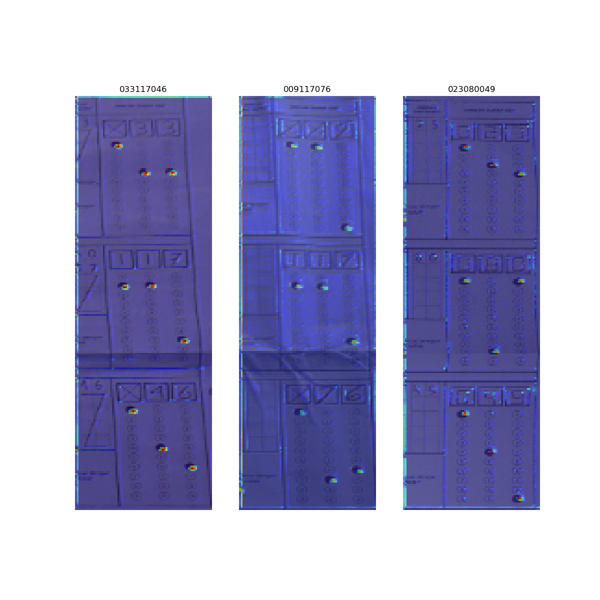

# Image to Text: Election Form Data Extraction

This project aims to develop an Image to Text model for extracting numerical results from election forms collected from various polling stations (TPS). The model utilizes Deep Learning techniques to process the images and extract the voting numbers of the three candidates.

## Dataset
The dataset consists of images of election forms obtained from different TPS locations. Each image contains the voting results for the three candidates. Here is an example of the dataset:

## Model Architecture
The model architecture involves convolutional neural networks (CNNs) for feature extraction and sequence-to-sequence models for recognizing and transcribing the numerical data from the images. GradCAM visualization is used to interpret and analyze the model's predictions. Here is an example of GradCAM visualization for a prediction:

## Usage
1. **Data Preprocessing**: Prepare the dataset by resizing and normalizing the images.
2. **Model Training**: Train the Image to Text model using the prepared dataset.
3. **Evaluation**: Evaluate the model's performance using metrics such as character-level error rate (CER) and word-level error rate (WER).

